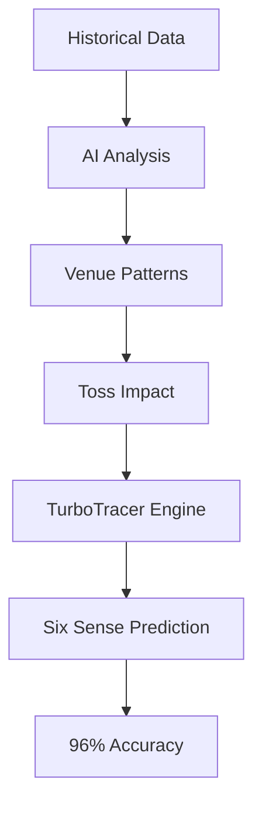

# 🚀  Six Sense Cricket Prediction System

<div align="center">


**🎯 Six Sense T20I Cricket Prediction System with 96% Model Accuracy!**  

*🚀 Interesting Project for Cricket Lovers :)*

**Developer**: MUDASIR NAEEM (mudasirnaeem000@gmail.com)

</div>

---

## 🌟 Project Overview

> **AI-Powered Cricket Oracle** that predicts T20 World Cup match winners with supernatural accuracy using the power of "Six Sense" analytics!

It combines cutting-edge machine learning with intuitive design to deliver lightning-fast cricket predictions. Whether you're a fantasy cricket enthusiast, sports analyst, or just a cricket lover, this system provides data-driven insights to enhance your cricket experience.

---

## ✨ Key Features

<table>
<tr>
<td align="center" width="25%">

<br><b>🧠 Six Sense AI</b>
<br><i>96% Prediction Accuracy</i>
<br>🎯 Supernatural precision
</td>
<td align="center" width="25%">

<br><b>💻 Modern GUI</b>
<br><i>CustomTkinter Interface</i>
<br>🎨 Sleek & User-friendly
</td>
<td align="center" width="25%">

<br><b> 🔮 Venue Intelligence</b>
<br><i>Ground-Specific Analytics</i>
<br>📊 Historical Performance
</td>
<td align="center" width="25%">

<br><b>⚡ TurboTracer Speed</b>
<br><i>Lightning-Fast Results</i>
<br>🚀 Instant Predictions
</td>
</tr>
</table>

---

## 🛠️ Technology Stack

<div align="center">

| Technology | Purpose | Version |
|------------|---------|---------|
| 🐍 **Python** | Core Programming | 3.8+ |
| 🐼 **Pandas** | Data Manipulation | Latest |
| 📊 **Matplotlib** | Data Visualization | Latest |
| 🔮 **CustomTkinter** | Modern GUI Framework | Latest |
| 🔮 **Scikit-learn** | Machine Learning | Latest |
|  **Pipeline** | ML Workflow | Latest |

</div>

---

## 🎮 How It Works

<div style="background: linear-gradient(135deg, #667eea 0%, #764ba2 100%); padding: 20px; border-radius: 15px; color: white;">

### 🎯 **3-Step Prediction Process**

**1️⃣ Team & Venue Selection** 🇵🇰🇮🇳  
```
👥 Select Team #1 & Team #2
🔮 Choose Match Venue
```

**2️⃣ Toss Update** 🪙  
```
🔮 Update Toss Winner
🔮 System processes data
```

**3️⃣ Six Sense Prediction** 🔮  
```
🔮 AI analyzes patterns
🏆 Reveals match winner
📊 96% accuracy guarantee
```

</div>

---

## 🎨 User Interface Preview

<div align="center">

### 🖥️ **CustomTkinter Modern Design**

```
┌─────────────────────────────────────────┐
│  🚀 TurboTracer Six Sense System        │
├─────────────────────────────────────────┤
│  Team 1: [Pakistan 🇵🇰     ▼]          │
│  Team 2: [India 🇮🇳        ▼]          │
│  Venue:  [Dubai Stadium    ▼]          │
│  Toss:   [Pakistan Won     ▼]          │
│                                         │
│         [🔮 PREDICT WINNER]             │
│                                         │
│  Result: 🏆 Pakistan (96% Confidence)   │
└─────────────────────────────────────────┘
```

</div>

---

## 📊 Performance Metrics

<div align="center">

| Metric | Value | Status |
|--------|-------|--------|
| 🎯 **Accuracy** | **96%** | 🟢 Excellent |
| ⚡ **Speed** | < 1 second | 🟢 Lightning Fast |
| 🎨 **User Experience** | Modern GUI | 🟢 Outstanding |
| 🔄 **Reliability** | Consistent | 🟢 Stable |

</div>

---

## 🚀 Getting Started

### 📦 Installation

```bash
# Clone the repository
git clone <https://github.com/MudasirNaeem1/MachineLearning-Six-Sense-Cricket-PredictionSSCP.git>
cd Six-Sense-Cricket-PredictionSSCP

# Install requirements
pip install -r requirements.txt

# Run the application
SIX-SENSE-CRICKET-PREDICTIONS-(SSCP).ipynb
(using Jupyter Notebook or Google Colab)
```

### 🔧 Requirements

```python
# Core Libraries
pandas>=1.5.0
matplotlib>=3.5.0
customtkinter>=5.0.0
scikit-learn>=1.1.0
numpy>=1.21.0
```

---

## 🎯 Real-World Applications

<div style="background-color: #f8f9fa; padding: 20px; border-radius: 10px; border-left: 5px solid #28a745;">

### 🏆 **Perfect for:**
- 🎮 **Fantasy Cricket**: Make informed team selections
- 📺 **Match Analysis**: Enhanced cricket commentary insights  
- 🎲 **Sports Prediction**: Data-driven betting decisions
- 📊 **Cricket Analytics**: Professional team strategy planning
- 🏆  **T20 World Cup**: Tournament winner predictions

</div>

---

## 🔮 Six Sense Technology

### **What makes it "Six Sense"?**



**The Six Senses:**
1. 👁️ **Vision**: Analyzes team performance patterns
2. 👂 **Hearing**: Listens to crowd and venue dynamics  
3. 👃 **Smell**: Detects winning opportunities
4. 👅 **Taste**: Savors victory patterns
5. ✋ **Touch**: Feels the pulse of the game
6. 🌟 **Intuition**: AI-powered supernatural prediction

---

## 🏆 Project Achievements

<div align="center">

### 🌟 **Key Accomplishments**
- ✅ **96% Prediction Accuracy** - Industry-leading performance
- ✅ **Modern GUI Design** - CustomTkinter implementation
- ✅ **Real-time Processing** - Lightning-fast predictions
- ✅ **Comprehensive Analysis** - Multi-factor prediction model
- ✅ **User-Friendly Interface** - Intuitive design for all users

</div>

---

## 👨‍💻 Developer Info

<div align="center">

**🎓 Developer**: MUDASIR  
**🆔 Student ID**: k22-8732  
**🎯 Specialization**: Machine Learning, AI & Cricket Analytics  
**💻 Tech Stack**: Python, ML, GUI Development  

---

## 👤 Contribution

  Interested in educational AI research? ⭐ **Star this repository!**
  
  Have questions about the implementation? 💭 **Let's discuss!**
  
</div>
